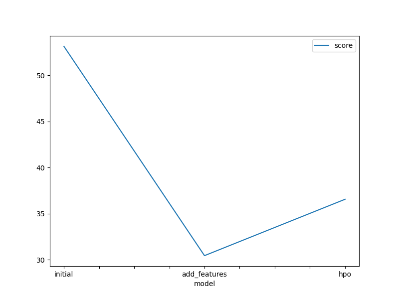
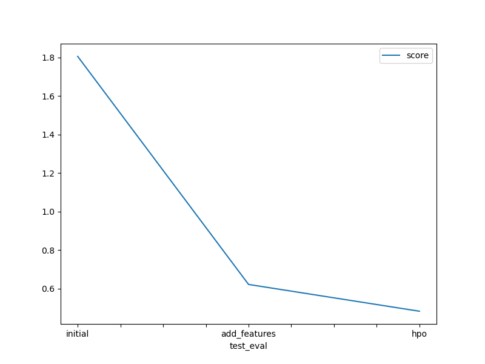

# Report: Predict Bike Sharing Demand with AutoGluon Solution
#### Shruti Pinjarkar

## Initial Training
### What did you realize when you tried to submit your predictions? What changes were needed to the output of the predictor to submit your results?
Initially, I did not realize I had to install Kaggle using !pip install kaggle  to access their API, as it was not in the instructions. Once I did, I was able to download the dataset, files, and submit predictions successfully. I also did not realize that Kaggle would not accept negative values obtained from the predictors for submission.Therefore, I set the negative values to 0.

### What was the top ranked model that performed?
The top ranked model that performed was the hpo_model that used WeightedEnsemble_L3. It resulted in a validation RMSE score of 36.56 and the best submission score for Kaggle at 0.48.

## Exploratory data analysis and feature creation
### What did the exploratory analysis find and how did you add additional features?
The feature "datetime" was hourly information so I added data for "year", "month", "day", and "hour as distinct features from "datetime". Additionally, "season" and "weather" were transformed to categorical type.

### How much better did your model perform after adding additional features and why do you think that is?
My model's performance improved by 22.68 points, from the initial model of 53.143041 to the model with additional features of 30.459500. It resulted in a RMSE score of 1.80608 to 0.62213. Ideally, we want our RMSE score to be within 0 and 1. I think the additional features which changed data types into true categorical datatypes and the feature of ignoring the "casual" and "registered" columns helped with reducing multicolinearity and improved interpretability.

## Hyper parameter tuning
### How much better did your model preform after trying different hyper parameters?
After trying different parameters, the model's kaggle score improved by 0.13906 points, from 0.62213 to an improved score at 0.48307. However, the RMSE score increased from 30.4595 to 36.5601. 

### If you were given more time with this dataset, where do you think you would spend more time?
If I were given more time, I would perhaps try some more different model algorithms and see how each model performs. I would also change the parameters around to see how it affects the fit of the model and learn more about hyperparameters.

### Create a table with the models you ran, the hyperparameters modified, and the kaggle score.
|model|hpo1|hpo2|hpo3|score|
|--|--|--|--|--|
|initial|default|default|default|1.80608|
|add_features|default|default|default|0.62213|
|hpo|GBM: num_boost_round: 100,num_leaves(lower=26, upper=66)|NN_TORCH: num_epochs: 10), activation('relu', 'softrelu', 'tanh'), dropout:(0.0, 0.5, default=0.1)|search_strategy: 'auto', num_trials: 5, scheduler: local|0.48307|

### Create a line plot showing the top model score for the three (or more) training runs during the project.

TODO: Replace the image below with your own.

### Create a line plot showing the top kaggle score for the three (or more) prediction submissions during the project.

TODO: Replace the image below with your own.

## Summary
For this project, I was able to use AutoGluon to train a regression model for predicting bike sharing demand and get a feel for what it's like to enter a Kaggle competition. The project was implemented in AWS Sagemaker Studio.

The AutoGluon 1.1.1 documentation was very helpful for using current code and the AutoGluon AutoML framework for Tabulary Data was incorporated into the project in an automated way which explored the best possible options.

The initial model was trained on the train dataset and resulted in a RMSE score of 1.80608 for the first Kaggle submission.

Exploratory Data Analysis were helpful for identifying which variables were useful and not as useful as datatypes for the model and feature engineering using the "datetime" column. It resulted in a significant improvement of reducing the RMSE score by 1.18395, from 1.80608 to a RMSE score of 0.62213.

Optimizer and hyperparameter tuning using AutoGluon on Neural Networks and Gradient Boost model algorithms were performed. The top ranked model that performed used WeightedEnsemble_L3. The RMSE score improved from 0.62213 to 0.48307.

